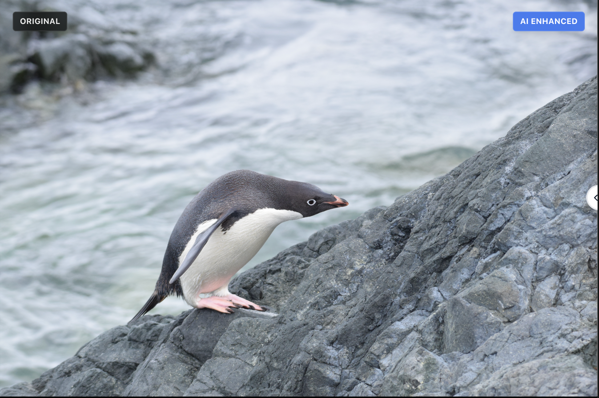
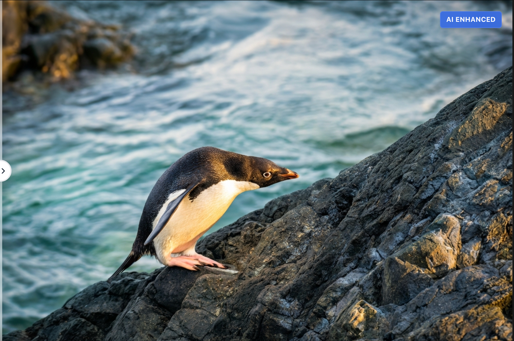

# PhotoRank AI 📸

[📖 简体中文文档 (Chinese Readme)](README_zh.md)

**AI-Powered Professional Photo Culling & Enhancement Tool**

PhotoRank AI helps photographers automate the tedious process of selecting the best shots from thousands of images. Import a folder, let AI score every photo, then enhance your favorites — all running locally on your machine.


---

## ✨ Features

### 🎯 AI Photo Scoring
- **Local AI Scoring** — NIMA + CLIP models run on your machine (no cloud API needed)
- **Multi-dimensional analysis** — Composition, lighting, technical quality, aesthetics
- **Batch processing** — Score hundreds of photos in minutes with GPU acceleration
- **Reciprocal Rank Fusion (RRF)** — Combines NIMA & CLIP rankings for reliable scoring

### 🌍 Multilingual UI & Flexible AI
- **i18n Support** — Seamlessly switch between English and Chinese (简体中文) interfaces.
- **Multiple AI Providers** — Use Google Gemini or Alibaba Qwen (千问) for enhancements.
- **Smart Fallback** — Automatically switches to a backup model if the primary one hits rate limits.

### 🖼️ Supported Image Formats
| Type | Formats |
|------|---------|
| **Standard** | JPG, JPEG, PNG, WEBP, AVIF, TIFF, BMP |
| **RAW** | CR2, CR3 (Canon), NEF (Nikon), ARW (Sony), DNG, RAF (Fuji), ORF (Olympus), RW2 (Panasonic) |

### 🎨 Two Enhancement Modes
| Mode | Speed | How It Works |
|------|-------|--------------|
| **Fast** 🔵 | ~25s | Direct AI evaluation and enhancement (Gemini or Qwen) |
| **Pro** 🟣 | ~2min | Iterative AI refinement with critique loop |

<p align="center">
  
  
</p>
<p align="center"><em>Before → After: One-click AI enhancement</em></p>

### 🔍 Smart Features
- **Burst Detection** — Automatically groups visually similar shots using CLIP embeddings
- **Batch Export** — Export selected photos with their high-resolution enhanced images saved directly to disk.

### 🔒 Privacy-First
- All scoring runs **locally** on your machine
- Images never leave your computer for scoring
- Enhancement requires API keys (Gemini or DashScope), both processed securely locally.

---

## 💻 System Requirements

### Minimum Requirements
| Component | Requirement |
|-----------|-------------|
| **OS** | macOS 12+, Windows 10+, or Linux (Ubuntu 20.04+) |
| **CPU** | 64-bit processor, 4+ cores recommended |
| **RAM** | **8 GB** minimum (16 GB recommended) |
| **Disk Space** | ~3 GB (models + dependencies) |
| **Node.js** | v18 or higher |
| **Python** | 3.9 – 3.12 |
| **pip** | Latest version recommended |

### GPU Acceleration (Highly Recommended)

GPU significantly speeds up scoring — **5–10× faster** than CPU.

| Platform | Backend | Notes |
|----------|---------|-------|
| **Apple Silicon** (M1/M2/M3/M4) | MPS (Metal) | ✅ Auto-detected, no setup needed |
| **NVIDIA** (GTX 1060+) | CUDA 11.8+ | Install [PyTorch with CUDA](https://pytorch.org/get-started/locally/) |
| **CPU-only** | — | Works, but slow (~5s/photo vs ~0.5s/photo with GPU) |

> [!TIP]
> On first run, the backend downloads the CLIP ViT-L/14 model (~1.7 GB). Ensure stable internet for initial setup.

---

## 🚀 Getting Started

### 1. Clone & Install

```bash
git clone https://github.com/Shadyupup/PhotoRankAI.git
cd PhotoRankAI
npm install
```

### 2. Set Up the Backend

```bash
cd backend

# (Recommended) Create a virtual environment
python -m venv venv
source venv/bin/activate   # macOS / Linux
# venv\Scripts\activate    # Windows

pip install -r requirements.txt
python server.py
```

The backend starts on `http://localhost:8100`. It auto-downloads AI models on first run.

> [!NOTE]
> The NIMA model (~50 MB) downloads instantly. The CLIP model (~1.7 GB) may take a few minutes on first launch.

### 3. (Optional) Set API Keys

For **Fast** and **Pro** enhancement modes, you need an API key (Gemini or DashScope).

**Option A — Via the UI (recommended):**
Click the ⚙️ Settings gear in the top-right corner, select your provider, and paste your key.

**Option B — Via .env file:**
```bash
cp .env.example .env
# Edit .env and add your key:
# VITE_GEMINI_API_KEY=your_key_here
# VITE_DASHSCOPE_API_KEY=your_dashscope_key_here
```

Get a free API key at [aistudio.google.com/apikey](https://aistudio.google.com/apikey) or [dashscope.console.aliyun.com](https://dashscope.console.aliyun.com/).

> [!NOTE]
> AI scoring works **without** any API key. Only the enhancement feature requires one.

### 4. Run the App

```bash
# Web app (development)
npm run dev

# Desktop app (Electron)
npm run electron:dev
```

Open [http://localhost:5173](http://localhost:5173) in your browser (web mode).

---

## 📖 Usage Guide

### Step 1 — Import Photos
1. Click **"Import Folder"** or drag-and-drop a folder onto the app
2. The app loads thumbnails from all supported image formats (including RAW)

### Step 2 — Score with AI
1. Click **"Score All"** to batch-score every imported photo
2. The backend uses NIMA (technical quality) + CLIP (aesthetic quality) to rank photos
3. Each photo gets a **0–100 score** with a breakdown reason
4. Photos are automatically sorted by score — best shots rise to the top

### Step 3 — Review & Filter
- Use the **score slider** to filter photos (e.g., show only 70+ scored photos)
- Toggle **burst detection** to group visually similar shots together
- Click any photo for a detailed score breakdown (NIMA vs. CLIP)

### Step 4 — Enhance (Optional)
- Select a photo and choose an enhancement mode:
  - **Fast Mode** — Direct Gemini/Qwen generation, ~25s per photo
  - **Pro Mode** — Iterative AI refinement, ~2min per photo

### Step 5 — Export
- Select the photos you want to keep
- Click **"Export"** to save them to your desired folder

---

## 🏗️ Tech Stack

| Layer | Technology |
|-------|-----------|
| **Frontend** | React 19 + TypeScript + Vite |
| **Styling** | Tailwind CSS + Framer Motion |
| **Storage** | Dexie.js (IndexedDB) |
| **AI Scoring** | NIMA (MobileNetV2) + CLIP (ViT-L/14) via FastAPI |
| **Enhancement** | Google Gemini API / Alibaba DashScope API |
| **Desktop** | Electron |

---

## 📁 Project Structure

```
├── src/                  # React frontend
│   ├── components/       # UI components
│   ├── hooks/            # Custom React hooks
│   └── lib/              # Core logic (scoring, enhancement, DB)
├── backend/              # Python FastAPI server
│   ├── server.py         # API endpoints
│   ├── scorer.py         # NIMA + CLIP scoring models
│   └── requirements.txt  # Python dependencies
├── electron/             # Electron main process
└── .env.example          # Environment variable template
```

---

## 🔌 API Reference

The backend exposes the following endpoints at `http://localhost:8100`:

| Method | Endpoint | Description |
|--------|----------|-------------|
| `GET` | `/health` | Health check — verify models are loaded |
| `POST` | `/api/score` | Score photos (accepts file blobs or file paths) |
| `GET` | `/api/preview?path=...` | Get image preview (auto-handles RAW files) |
| `POST` | `/api/cluster` | Group similar photos by CLIP embeddings |

---

## 🧪 Running Tests

```bash
# Frontend unit tests (Vitest)
npx vitest run

# Backend unit tests (pytest)
cd backend && python -m pytest test_scorer.py -v
```

---

## ❓ Troubleshooting

| Problem | Solution |
|---------|----------|
| `ModuleNotFoundError: No module named 'torch'` | Run `pip install -r backend/requirements.txt` in your Python environment |
| Backend starts but scoring is slow | Check GPU: run `python -c "import torch; print(torch.backends.mps.is_available())"` (Mac) or `torch.cuda.is_available()` (NVIDIA) |
| CLIP model download fails | Ensure stable internet; models cache to `~/.cache/huggingface/` — you can retry |
| Port 8100 already in use | Kill the existing process: `lsof -ti:8100 \| xargs kill` |
| RAW files not loading | Ensure `rawpy` installed correctly: `pip install rawpy` |
| `npm run dev` fails | Make sure Node.js 18+ is installed: `node --version` |

---

## 🤝 Contributing

Contributions are welcome! Please:

1. Fork the repo
2. Create a feature branch (`git checkout -b feature/amazing-feature`)
3. Commit your changes (`git commit -m 'Add amazing feature'`)
4. Push to the branch (`git push origin feature/amazing-feature`)
5. Open a Pull Request

---

## 📄 License

[MIT](LICENSE) © 2026 PhotoRank AI
